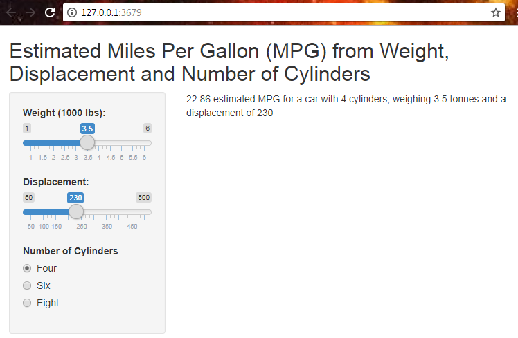

```{r setup, include=FALSE}
knitr::opts_chunk$set(echo = FALSE)
mtcars$cyl <- as.factor(mtcars$cyl)
model = lm(mpg ~ wt + disp + cyl, data=mtcars)
```
## Introduction
A cars MPG is an important metric to understand for current or perspective car owners as it is a good indication of a vehicles running and environmental costs.  This application will allow a user to estimate the MPG based on various aspects of the car (Weight, Displacement and Number of Cylinders).

## Motor Trend Card Road Tests Dataset

The data was extracted from the 1974 Motor Trend US magazine, and comprises fuel consumption and 10 aspects of automobile design and performance for 32 automobiles (1973–74 models).  

```{r model, results=TRUE, eval=TRUE, echo=FALSE}
library(shiny)
# Model Building
head(mtcars,10)
```

## The Model
A linear regression model was created using Weight, Displacement and Number of Cylinders as predictors to estimate the MPG.  The user will input the a set of input values using a variety of sliders and radio buttons.  The linear regression model will be used to predict the MPG based on these values
```{r code, echo = TRUE, results=FALSE, eval=FALSE}
#Model
mtcars$cyl <- as.factor(mtcars$cyl)
model = lm(mpg ~ wt + disp + cyl, data=mtcars)

#Prediction
newcar = data.frame(wt=input$wt, disp=input$disp, cyl=factor(input$cyl))
predict(model, newcar) 
```

```{r plot, fig.height=2}
library(ggplot2)
    p1<-ggplot(model, aes(.fitted, .resid))+geom_point()
    p1<-p1+stat_smooth(method="loess")+geom_hline(yintercept=0, col="red", linetype="dashed")
    p1<-p1+xlab("Fitted values")+ylab("Residuals")
    p1<-p1+ggtitle("Residual vs Fitted Plot")+theme_bw()
    p1
```

## Interface Design
To change the input variables used to estimate the MPG, select the required Weight, Displacement and Number of Cylinders using the sliders and radio buttons on the left.  The results are shown on the right.



